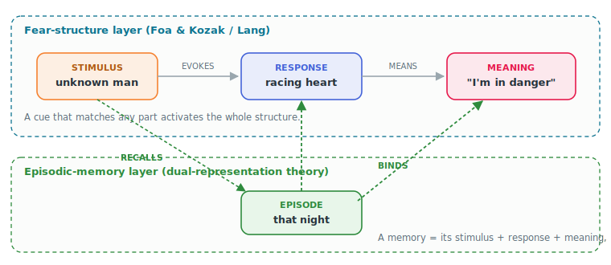
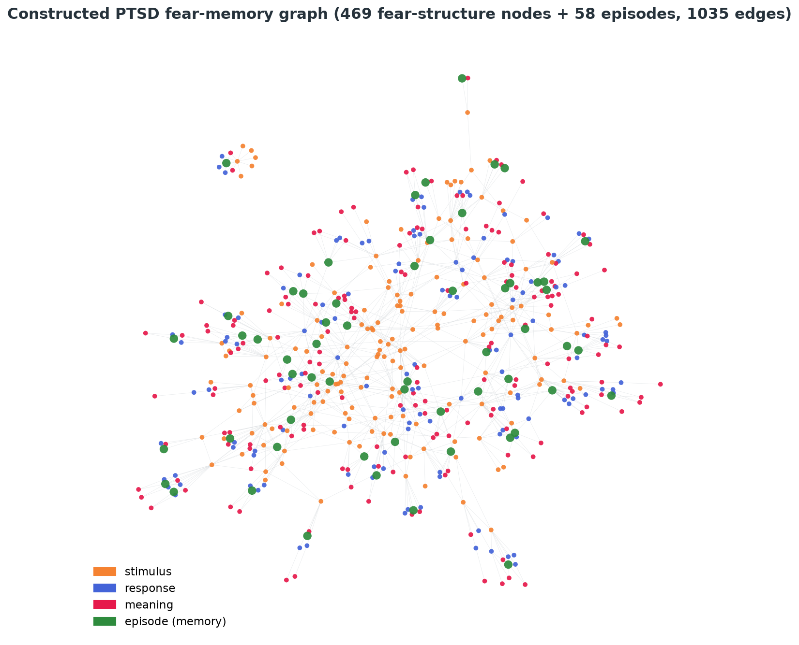
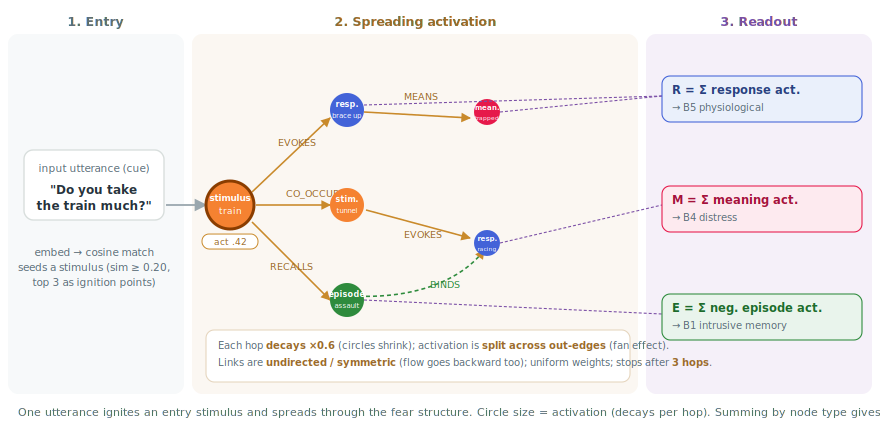
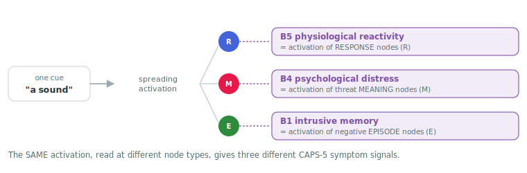
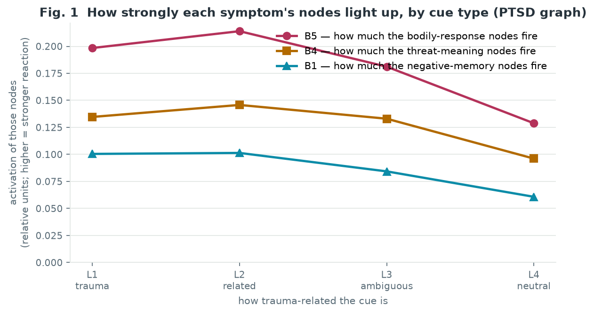
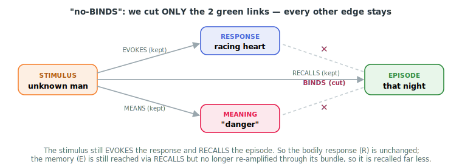
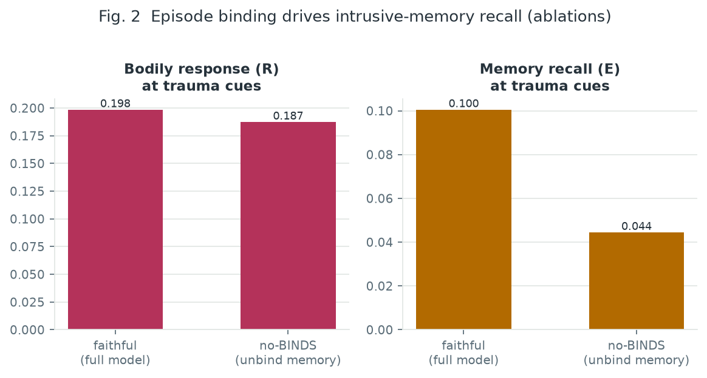
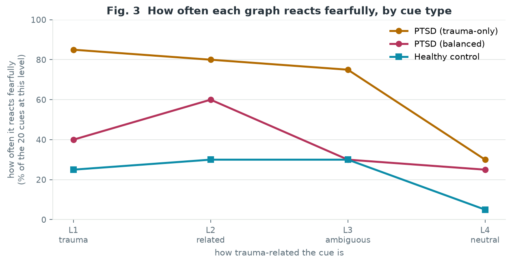

# Symptoms from Structure: A Theory-Faithful Fear-Memory Graph Reproduces PTSD Reactivity

*Progress report (draft toward a CHI 2027 short paper). Figures embedded; numbers from the accompanying measurements. Items marked ⟨…⟩ need verification.*

## Terms (defined up front)

- **Fear-memory graph**: a map of "nodes and edges" built automatically from an account of a trauma. Nodes are stimuli, responses, meanings, and episodes (past events).
- **Spreading activation**: a classic associative-retrieval mechanism [Collins &amp; Loftus 1975]. We place a quantity ("activation") on a node and let it flow along edges, weakening with distance. A partner's utterance injects activation, and connected nodes light up in turn.
- **Over-generalization**: reacting to things that are not actually dangerous, or only loosely related to the trauma. A core feature of PTSD.
- **Fear reaction**: the agent treating a cue as dangerous — being afraid of it (the concrete test is in §4).
- **Method artifact**: a spurious effect that comes from the method itself rather than a real property of the model.

## Abstract

Simulated patients — computational stand-ins that a trainee clinician can interview — are a promising way to teach skills such as trauma-focused therapy without practicing on real patients. Today's large-language-model (LLM) simulated patients condition symptoms on a *prompt*: the behavior is role-play, its internal cause cannot be inspected, and it cannot *change* under treatment. We take the opposite stance — **symptoms should emerge from the structure of memory** — and build a dialogue agent whose reactivity is produced by spreading activation over a fear-memory graph that is faithful to Foa and Kozak's theory of fear. Before adding dialogue and clinical scoring, this paper validates the graph itself. We ground the evaluation in the CAPS-5, the standard PTSD interview, focus on its intrusion (B) criteria, and map four of them to graph measurements. Feeding 80 utterances graded by trauma-relatedness, we show that (1) *one* spreading process, read at different node types, yields *separable* signals for physiological reactivity (B5), psychological distress (B4) and intrusive memory (B1); (2) these depend on propagation through the graph (stopping it makes the signal vanish); and (3) the agent over-generalizes — reacting to trauma-*unrelated* cues — relative to a size-matched healthy graph built the same way.

## 1. Introduction

Post-traumatic stress disorder (PTSD) follows a traumatic event and is marked by symptoms that persist long after it: intrusive memories, flashbacks, avoidance, hyperarousal, and strong reactions to cues that merely *resemble* the trauma. Clinicians who treat PTSD (e.g. with exposure therapy) need to practice, but they cannot rehearse on real patients, and actor-based standardized patients are costly and reveal nothing of the patient's inner state. This motivates *simulated patients*: agents a trainee can talk to [PATIENT-Ψ].

Current LLM simulated patients encode the patient as a static description and let the model role-play it. The behavior can be convincing, but three properties matter for a training tool and are missing: (a) the *internal* associative process behind an utterance cannot be observed; (b) turn-to-turn consistency is not mechanistically guaranteed; and (c) the patient cannot *change* under treatment, so exposure/extinction cannot be practiced. We argue these follow from one design choice: whether symptoms are *acted* (conditioned on a prompt) or *emerge from a structure* (produced by a memory mechanism). We take the second stance and implement it faithfully to clinical theory (§2).

This paper reports the first, deliberately narrow step: validating the memory graph itself. Contributions: (1) a memory design translated from Foa and Kozak's fear-structure theory into a two-layer graph (§3); (2) a mapping from the CAPS-5 intrusion criteria to graph measurements, with the observation that one mechanism read at different node types produces separable symptom signals (§3.3, §5.1); and (3) a quantitative demonstration of over-generalization against a same-pipeline, size-matched healthy control (§5.3).

## 2. Background

### 2.1 Foa and Kozak's fear structure

Foa and Kozak [Foa1986], building on Lang [Lang1979], cast fear not as a single concept but as a **structure** in memory: an associative network of three kinds of element — **stimulus** (what was seen/heard, where), **response** (bodily/behavioral reactions such as a racing heart), and **meaning** (what the stimulus and response signify, e.g. "I am in danger"). A defining property is that matching *part* of the structure activates the *whole*: a small cue can set off the entire network. Fear becomes *pathological* not by adding a special node but when its associations are *erroneous and unusually strong* (harmless stimuli become tied to danger). Lang adds that the **response** elements are the seat of emotion. Because symptoms here are properties of the structure rather than a script, the theory suits a patient model.

### 2.2 Assessing PTSD: the CAPS-5 intrusion criteria

The Clinician-Administered PTSD Scale for DSM-5 (CAPS-5) is the standard structured interview for diagnosing and rating PTSD. It scores several symptom clusters (exposure, intrusion, avoidance, negative cognition/mood, arousal). We focus on the **intrusion (B) cluster**, the hallmark re-experiencing symptomatology and the most direct target for a memory-based model. It has five items: **B1** unwanted intrusive memories, **B2** nightmares, **B3** flashbacks (re-living the event as if now), **B4** intense psychological distress to trauma cues, and **B5** marked physiological reactivity to trauma cues.

Because our goal is to validate the memory structure, we map the B criteria to graph measurements, starting with what a memory graph can express: B5, B4, B1, and (as a design, §6) B3. B2 (nightmares) would need a sleep/dream mechanism we do not model (one B-cluster symptom suffices for the diagnostic structure).

### 2.3 Related work

PATIENT-Ψ [PATIENT-Ψ] builds LLM simulated patients from CBT case-conceptualization diagrams and improves on textbook/role-play training in clinician-rated skill acquisition. ACT-R and adaptive-network models reproduce PTSD symptom phenomena [Smith2021]. In neither is the trauma-memory dynamic a *running, inspectable* mechanism built on a Foa-faithful fear structure — the gap this work addresses.

## 3. A fear-memory graph and its symptom readouts

### 3.1 Design: from Foa's elements to a two-layer graph

We translate Foa's three element types into node types and their associations into edge types, and add an episodic layer for autobiographical memory. The **fear-structure layer** has stimulus, response, and meaning nodes; meaning is kept as free-form text, not collapsed into a fixed set of categories. Its edges are `EVOKES` (stimulus–response), `MEANS` (stimulus/response–meaning), `CO_OCCURS` (stimulus–stimulus), and `SIMILAR` (semantic stimulus generalization). The **episodic layer**, grounded in dual-representation theory of PTSD [Brewin2010], holds autobiographical episodes joined to the fear structure by `RECALLS` (stimulus→episode) and `BINDS` (episode↔response/meaning). `BINDS` is the key: it stores a memory as a *bundle* of the stimulus, response, and meaning that occurred together. The graph is built automatically from a first-person narrative by LLM extraction; each episode is tagged with an emotional valence (negative/neutral/positive) from context.

**Schematic A.** Node types and edges. Upper layer: Foa's stimulus–response–meaning network (matching any part activates the whole). Lower layer: autobiographical episodes. An episode is not a bare node but a **bundle**: `BINDS` ties it back to the response and meaning that occurred, so recalling the memory re-ignites its bodily and interpretive content.

As a simplification, edge weights are near-uniform (we do not model fine differences in associative strength); threat-centrality is not injected by any external bias but must arise from the structure itself (from the abundance of negative episodes and meanings); only `SIMILAR` is weighted, by semantic similarity, to express generalization.

Schematic A is a concept sketch; a graph actually built from a first-person account looks like Fig. C.

**Fig. C. An automatically constructed PTSD graph** (trauma-only; 469 fear-structure nodes + 58 episodes, 1035 edges). Colors mark node type (orange = stimulus, blue = response, red = meaning, green = memory). The abstract structure of Schematic A materializes, from real data, as this dense fear network, with memories (green) embedded among tightly interlinked stimuli, responses and meanings.

### 3.2 Spreading activation: how reactivity is produced

Recall runs by spreading activation (see Terms). The steps: (1) embed the input utterance as a vector and seed activation at the semantically nearest stimulus nodes — we call this the **entry step** (top 3, cosine similarity ≥ 0.20); (2) let activation flow along edges, weakening at each hop (hop decay ×0.6) and dividing when it branches (fan effect); links are undirected/symmetric, so flow also runs backward, and it stops after 3 hops; (3) read the activation that accumulated at each node. Following Lang, we read **fear** from the activation on response nodes. Fig. D shows this "utterance → entry → spread → readout" flow on one page.

**Fig. D. From an input utterance, through the graph, to symptom readouts.** (1) Entry: the utterance is embedded and ignites the nearest stimulus by cosine similarity (ignition = thick-bordered orange). (2) Spreading: activation follows the fear-structure edges (EVOKES/MEANS/CO_OCCURS/RECALLS/BINDS) for up to 3 hops, decaying ×0.6 per hop (circles shrink) and splitting across out-edges (fan effect); because links are undirected it also flows backward. (3) Readout: the accumulated activation is summed by node type into response=R (B5), meaning=M (B4), and negative-episode=E (B1). The green dashed BINDS is the bridge that re-binds an episode to its response/meaning, amplifying memory recall (E).

### 3.3 Mapping the CAPS-5 intrusion criteria to graph measurements

The key move: the *same* spreading activation, read at *different* node types, corresponds to different symptoms (possible only because stimulus, response, meaning and episode are separate nodes).

| CAPS-5 symptom | readout | activation summed over… | example nodes in *this* patient's graph |
|---|---|---|---|
| **B5** physiological reactivity | R | response nodes | "strong tension", "breathlessness", "panic attack" |
| **B4** psychological distress | M | threat/negative meaning nodes | "it's not safe here", "no escape", "the assailant is here" |
| **B1** intrusive memory | E | negative episode nodes | "a panic attack in the tunnel", "the assailant's face in a stranger's face" |
| **B3** flashback (design, §6) | S/(S+C) | sensory vs. contextual activation (introduced in §6) | — |

**Worked example.** The cue "someone's behind me" enters at the stimulus *unknown man* and spreads to the response *racing heart* (contributes to R), the meaning *the assailant is here* (M), and the episode *that night* (E) — one wave of activation, three readouts.

**Schematic B.** One utterance injects one wave of activation; reading it at the response, meaning, or episode nodes gives three symptom signals (B5/B4/B1). Because the theory gives these elements distinct nodes, distinct symptoms fall out of the same mechanism — we do not write a separate rule per symptom.

In this paper we actually measure **B5, B4 and B1** (Fig. 1). B3 (flashback) is positioned as a design (above), but measuring it requires splitting each episode into sensory (S) and contextual (C) nodes; we therefore **leave B3 to future work** (§6).

## 4. Experiment: validating the memory graph by cue-relatedness

**Three graphs (Table 1).** Built through the *same* pipeline: **PTSD (trauma-only)** from a first-person PTSD account; **PTSD (balanced)**, the same account plus ordinary/positive daily-life material (so one person's graph holds both trauma and non-trauma memory); and a **Healthy control** from an independent, length-matched non-trauma narrative.

**Table 1. Graph sizes (same pipeline).**

| Graph | nodes | episodes (neg/neu/pos) | edges |
|---|---|---|---|
| PTSD (trauma-only) | 469 | 58 (40/3/15) | 1035 |
| PTSD (balanced) | 574 | 70 (38/0/32) | 1288 |
| Healthy control | 528 | 68 (18/21/29) | 1254 |

A benign narrative yields little fear structure (the extractor finds little to extract) — itself a first result: an ordinary life does not encode as a dense fear network. We nonetheless matched node counts by using a comparably long healthy narrative.

**Cue battery (80 utterances).** Short things a partner or friend might say, graded by trauma-relatedness into four levels (20 each). Levels are an *independent* axis (LLM-generated, for clinical review), not embedding distance, to avoid circularity with the entry step.

| Level | what it is | example cue |
|---|---|---|
| **L1** trauma-core | directly recalls the trauma scene | "there's someone right behind me" |
| **L2** related | could suggest danger | "a man was standing behind you just now" |
| **L3** ambiguous | ordinary, but could snag | "I'll be home a bit late tonight" |
| **L4** neutral | unrelated to the trauma | "nice weather — I'll hang the laundry out" |

**Measures (formulas).** Feeding one cue *c* and running spreading activation assigns an activation value *a(n)* to each node *n*. We sum by node type into three readouts:

- **R(c)** (B5) = sum of *a(n)* over all response nodes
- **M(c)** (B4) = sum of *a(n)* over all threat/negative meaning nodes
- **E(c)** (B1) = sum of *a(n)* over all negative episode nodes

Per level we report the mean over its 20 cues; the curve over L1→L4 is the *cue gradient*, and the steeper (more right-descending) it is, the better trauma-related and neutral cues are told apart. We summarize steepness by the L1÷L4 ratio.

**Fear-reaction rate (for cross-graph comparison).** The sums R, M, E grow with graph size, so different-sized graphs cannot be compared directly. We therefore use a size-independent yes/no measure — did the agent show a **fear reaction** to the cue? Since the model does not converse, we count a fear reaction when **both** hold:

1. the cue strongly matches something in memory (cosine similarity to the nearest stimulus at the entry step ≥ 0.35 — roughly, "it looks familiar"), **and**
2. the past episodes it evokes lean negative rather than positive.

When both hold, the agent treats the cue as dangerous (e.g. "a man behind you" → familiar, and it recalls the assault → treated as dangerous). The **fear-reaction rate** = the % of a level's 20 cues that produced a fear reaction (0–100%). A healthy graph should have a low rate, and especially should barely react to neutral cues.

**Ablation conditions.** `faithful` (full model), `no_spread` (no propagation along edges = entry match only ≈ vector search), `no_bind` (cut only the BINDS edges; see the schematic in §5.2).

## 5. Results

**How the three experiments stand together.** The three experiments (Figs. 1–3) are not independent tests; they build one claim in stages. Experiment 1 establishes that *the phenomenon exists*; Experiment 2 asks whether *it is a genuine mechanism* (not a by-product of text similarity); Experiment 3 asks whether *it is specific to trauma* (not an artifact of the method). Each stage answers a more falsifiable question than the last, closing off the rival hypotheses the previous stage leaves open.

| | Fig. | Question | Target / comparison | Claim that fails without it |
|---|---|---|---|---|
| **Exp. 1** Phenomenon | 1 | Does it react like a fear memory, and do the symptoms separate? | *Within* the PTSD graph, R/M/E by level | that the graph distinguishes fear at all (a flat curve makes the rest moot) |
| **Exp. 2** Mechanism | 2 | Is the reaction produced by propagation / what drives recall? | *Ablations* on the same graph | that reactivity comes from **propagation**, not mere entry-step text similarity; the two-layer division of labor |
| **Exp. 3** Specificity | 3 | Is the over-generalization specific to trauma, or a method artifact? | a size-matched **healthy graph** | that over-generalization is not something any large graph would show |

We take them in this order (flashback B3 is not measured here).

### 5.1 Does the graph react like a fear memory, and do symptoms separate? (Fig. 1)

**Graph & metric.** PTSD (trauma-only) graph. We plot R (B5), M (B4), E (B1) averaged per cue level, L1→L4.

**Why we expect a descending curve.** A memory that truly encodes fear should react more to trauma-related cues than to unrelated ones; if a curve were flat, the graph would not be distinguishing fear at all and nothing downstream would be meaningful. So the first thing to check is that the curve *descends* from L1 (trauma-core) toward L4 (neutral). PTSD's pathology, over-generalization, then shows up as a descent that is too *shallow* — staying high at L2–L3, cues that only *resemble* the trauma.

**Result.** All three readouts descend from L1 to L4 (L1÷L4: R 1.54, M 1.40, E 1.65) — the graph does discriminate — but only shallowly: at L2 (related) they are as high as L1 (e.g. E: L1 0.100, L2 0.101), and they stay elevated at L3 (ambiguous; E 0.084) before dropping at neutral L4 (E 0.061). The three curves also sit at different levels and slopes.

**Fig. 1.** Three readouts in the PTSD (trauma-only) graph. X-axis: cue level (left = closest to the trauma). Y-axis: how strongly that symptom's nodes fire (mean of R/M/E, arbitrary units; only comparisons between levels are meaningful). All three descend but stay high at L2–L3 = over-generalization.

> **At a glance.** One wave of activation, read at three node types, gives three separate symptom signals (B5/B4/B1). All three fall from trauma cues (L1) to neutral (L4), but stay high at L2–L3, cues that only resemble the trauma. That shallow, still-high middle is over-generalization.

### 5.2 Is the reaction produced by the graph, and what drives memory recall? (Fig. 2)

**Graph & metric.** PTSD (trauma-only) graph — this dissects the internals of *one* graph (not a cross-graph comparison). We report R and E at L1 (the strongest cues) under the full model and two ablations.

**What "cutting BINDS" means (Schematic U).** We cut only the two BINDS edges; every other edge stays. The stimulus still connects to the response (EVOKES), the meaning (MEANS), and the episode (RECALLS). Only "episode↔response/meaning" is cut.

**Schematic U.** `no_bind` cuts only the two BINDS links (green). The stimulus still EVOKES the response and RECALLS the episode, so the bodily response R is unchanged; the memory E is still reachable via RECALLS but is no longer re-amplified through its bundle, so it is recalled far less.

**Result.** With no propagation at all (`no_spread` = entry match only), both readouts are exactly 0.00 (that empty bar is omitted). Cutting only BINDS (`no_bind`) reduces intrusive memory E by 56% (0.100 → 0.044) but leaves the bodily response R essentially unchanged (0.198 → 0.187).

**Fig. 2.** Readouts in the PTSD (trauma-only) graph at L1 (strongest cues). Left: bodily response R. Right: memory recall E. Bars: full model vs. BINDS removed. Y-axis: activation (arbitrary units). Cutting BINDS roughly halves E while R is nearly unchanged.

> **At a glance.** Stop propagation and there is no reaction (0.00): the fear is produced by the graph, not by text similarity. Cut only BINDS and memory recall (E) halves while the bodily response (R) is untouched — the two layers do different jobs.

**What it means.** The fear response is produced by spreading through the graph (no propagation, no reaction). Memory recall (B1) depends specifically on BINDS: sever the tie between a memory and its bodily/interpretive content and recall collapses, while the immediate bodily response, driven directly by the stimulus, is untouched. The two layers do different jobs, as designed.

### 5.3 Is the over-generalization specific to trauma? (Fig. 3)

**Graphs & metric.** All three graphs. The metric is the **fear-reaction rate** from §4 (the % of cues to which the agent shows a fear reaction). The magnitudes R/M/E in Fig. 1 scale with graph size and cannot be compared across graphs, so here we use this size-independent yes/no summary of "does it react."

**Why a healthy control is needed.** The PTSD graph's high, broad reactivity could in principle be a method artifact — any large graph reacting to anything. To rule that out, we build a *healthy* person's account into a graph the same way and feed the same cues. A valid model should have the healthy graph react weakly and, above all, not over-generalize to neutral cues.

**Result.** PTSD (trauma-only) shows a fear reaction to 75–85% of L1–L3 cues — including *ambiguous* L3 (75%) — and only drops to 30% at neutral L4. The size-matched healthy graph reacts to just 25–30% at L1–L3 and 5% at L4. Adding the same person's ordinary/positive memories (balanced) lowers the whole curve (L1 85% → 40%).

**Fig. 3.** Fear-reaction rate for the three graphs. X-axis: cue level. Y-axis: the % of that level's 20 cues to which the agent showed a fear reaction. PTSD (trauma-only) is high even at ambiguous cues; the healthy control barely reacts to neutral ones.

> **At a glance.** The PTSD graph fears even ambiguous cues (75%); a healthy graph built the exact same way does not, and barely reacts to neutral cues (5%). The over-generalization comes from the trauma memory, not the method.

**What it means.** The over-generalization is real, not a method artifact: the healthy graph reacts only weakly to threat-themed cues and does not over-generalize to neutral ones (5% vs. the PTSD graph's 30% at L4). The balanced result adds a methodological lesson: a trauma-*only* narrative overstates reactivity because it contains almost nothing but threat, so the same person's ordinary memories — a competing "safe" pull — are a necessary part of a faithful model, and a healthy control is necessary to license the over-generalization claim.

## 6. Discussion

**Flashbacks (B3).** Our measurements cover B5/B4/B1. For flashbacks we adopt dual-representation theory [Brewin2010]: a flashback is a strongly activated **sensory** representation (S: sights, sounds, bodily reactions) with a **weak contextual** one (C: the "this happened then, there" tag). The sensory memory fires without the past tag, producing the sense of *nowness*. On the graph this is `S/(S+C)`, obtained by splitting each episode into sensory (S) and contextual (C) nodes. We scope the model to the S/C imbalance that produces nowness; complete dissociation (loss of present awareness), which implicates prefrontal control, is beyond a purely associative network and is out of scope.

**Interpretation is comparative.** Activations are unitless; PTSD-ness is defined relative to a reference — within-subject (trauma vs. ordinary memories) and between-subject (healthy control). A methodological lesson (§5.3): a trauma-only narrative alone confounds "the model over-generalizes" with "the narrative contains only threat," so a balanced narrative and a healthy control are necessary, not optional.

**Limitations.** Narratives are single first-person accounts; the entry step is embedding-based and reacts to generic words ("night", "everyday"); the dialogue front-end and visualization are not yet migrated to this design; citations need final verification.

## 7. Conclusion

Reading one spreading-activation process at different node types of a theory-faithful fear-memory graph yields separable signals aligned to the CAPS-5 intrusion criteria, and these over-generalize relative to a same-pipeline, size-matched healthy control. This inspectable, in-principle therapy-modifiable substrate is the basis for the next stage: a CAPS-5-based evaluation with clinician-audited scoring.

## References

- [Foa1986] Foa, E. B., &amp; Kozak, M. J. (1986). Emotional processing of fear: exposure to corrective information. *Psychological Bulletin, 99*, 20–35.
- [Lang1979] Lang, P. J. (1979). A bio-informational theory of emotional imagery. *Psychophysiology, 16*. ⟨verify⟩
- [Collins &amp; Loftus 1975] Collins, A. M., &amp; Loftus, E. F. (1975). A spreading-activation theory of semantic processing. *Psychological Review, 82*.
- [Brewin2010] Brewin, C. R., Gregory, J. D., Lipton, M., &amp; Burgess, N. (2010). Intrusive images / dual representation. *Psychological Review, 117*. ⟨verify⟩
- [EhlersClark2000] Ehlers, A., &amp; Clark, D. M. (2000). A cognitive model of PTSD. *Behaviour Research and Therapy, 38*.
- [PATIENT-Ψ] Wang, R. et al. (2024). PATIENT-Ψ: Using LLMs to simulate patients for training mental-health professionals. *EMNLP 2024*. arXiv:2405.19660.
- [Smith2021] Smith, R. et al. (2021). A computational model of PTSD and hippocampal volume. *Topics in Cognitive Science*. ⟨verify⟩
