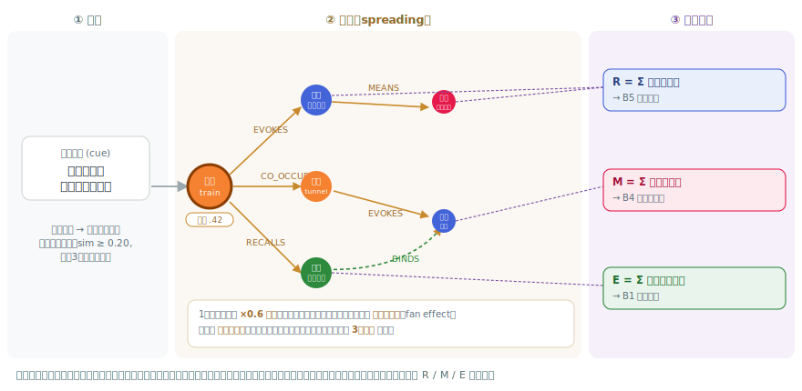

# 構造から症状へ：理論に忠実な恐怖記憶グラフによる PTSD 反応の再現

*研究進捗報告（CHI 2027 投稿に向けた草稿）。図は本文に埋め込み。数値は付随の測定結果に基づく。⟨…⟩ は要確認。*

## 用語ミニ辞典（先に置く）

本稿で繰り返し使う言葉を先に定義する。

- **恐怖記憶グラフ**：トラウマ体験の記述から自動で作った「点（ノード）と線（エッジ）」の地図。点は刺激・反応・意味・エピソード（過去の出来事）を表す。
- **拡散活性**：ある点に「活性」という量を置き、線を伝って周囲へ流す古典的な連想検索のしくみ。離れるほど弱まる [Collins &amp; Loftus 1975]。会話の相手の一言が地図に活性を投入すると、つながった点が次々に活性化する。
- **過般化**：本来は危険でない・トラウマと関係の薄いものにまで反応してしまうこと。PTSD の中核的な特徴。
- **恐怖反応**：エージェントがきっかけを「危険だ」とみなして怖がること。本稿での具体的な判定条件は §4。
- **手法由来の見かけの効果（artifact）**：モデルが本当に持つ性質ではなく、たまたま手法の副産物として出てしまう効果。

## 要旨

模擬患者——訓練中の臨床家が面接できる計算論的な患者役——は、実患者で練習せずにトラウマ療法などを学ぶ有望な手段である。現在の大規模言語モデル（LLM）による模擬患者は、症状を「プロンプトの指示」で作る。振る舞いは演技であり、なぜその反応をするのか内部を観察できず、治療によって変化もしない。本研究は逆に、**症状を「記憶の構造」から創発させる**立場をとる。Foa &amp; Kozak の恐怖の理論に忠実な恐怖記憶グラフを作り、その上で拡散活性を走らせて反応を生成する。本稿は、対話や臨床採点を加える前に、まず**グラフ自体が妥当な土台か**を検証する。評価は PTSD の標準的な診断面接 CAPS-5 の「侵入症状（B 基準）」に沿い、その4項目をグラフ上の測定量に対応づける。トラウマとの近さで並べた80発話を入力すると、(1) 一つの拡散活性を異なる種類の点で読むだけで、生理反応（B5）・心理的苦痛（B4）・侵入記憶（B1）の**別々の信号**が得られること、(2) それらがグラフ上の伝搬に依存すること（伝搬を止めると信号が消える）、(3) 同じ手順で作った健常者のグラフと比べて、トラウマと無関係な入力にまで反応する＝**過般化**すること、を示す。

## 1. はじめに

心的外傷後ストレス障害（PTSD）はトラウマ体験の後に生じ、その後も長く続く症状——侵入的な記憶、フラッシュバック、回避、過覚醒、トラウマに似ているだけのきっかけへの強い反応——を特徴とする。PTSD を治療する臨床家（たとえば曝露療法を行う）は練習を要するが、実患者では練習できず、役者による標準化患者は高コストで、しかも患者の内面が見えない。ここに模擬患者——訓練者が話しかけられる対話エージェント——の価値がある [PATIENT-Ψ]。

現在の LLM 模擬患者は、患者を静的な記述として与え、モデルに演じさせる。振る舞いは説得力を持ちうるが、訓練ツールとして重要な三点が欠ける。(a) ある発話の背後でどんな連想が起きたか、内部が観察できない。(b) ターンをまたいだ一貫性が機構的に保証されない。(c) 患者が治療によって変化できず、療法の中核である曝露・消去を練習できない。本研究はこれらを、症状を「演技する」のではなく「構造から創発させる」ことで解こうとし、臨床理論に忠実に実装する（§2）。

本稿はその最初の狭い一歩、**記憶グラフ自体の妥当性の検証**を報告する。貢献は、(1) Foa &amp; Kozak の恐怖構造理論を二層グラフへ翻訳した記憶の設計（§3）、(2) CAPS-5 の侵入症状をグラフ上の測定量に対応づけ、一つの機構から別々の症状信号が出ることの提示（§3.3・§5.1）、(3) 同一手順で作った健常統制に対する過般化の定量的実証（§5.3）である。

## 2. 背景

### 2.1 Foa &amp; Kozak の恐怖構造

Foa &amp; Kozak [Foa1986]（Lang [Lang1979] を踏まえる）は、恐怖を単一の概念ではなく記憶内の**構造**として捉えた。三種の要素——**刺激**（何を見聞きし、どこか）、**反応**（動悸など身体・行動の反応）、**意味**（刺激や反応が本人にとって持つ解釈。例「私は危険だ」）——が連想でつながったネットワークである。決定的な性質は、構造の一部にマッチすると全体が活性化すること。小さなきっかけがネットワーク全体を発火させる。恐怖が病的になるのは特別な点が加わるからではなく、連想が**誤って異常に強い**ときである（無害な刺激が危険に結びつく）。Lang はさらに、**反応**要素こそ情動の中心だとした。症状が台本ではなく構造の性質であるこの理論は、患者モデルの土台に向く。

### 2.2 PTSD の評価尺度 CAPS-5 と侵入症状

CAPS-5（Clinician-Administered PTSD Scale for DSM-5）は、PTSD の診断・重症度評価に使う標準的な構造化面接である。複数の症状群（曝露・侵入・回避・認知/気分の否定的変化・覚醒）を採点する。本稿が注目するのは**侵入症状群（B 基準）**で、これは再体験症状の中核であり、記憶ベースのモデルが最も直接に狙える標的である。5項目からなる。B1 望まない侵入的記憶、B2 悪夢、B3 フラッシュバック（今また起きているような再体験）、B4 きっかけへの強い心理的苦痛、B5 きっかけへの顕著な生理反応。

記憶グラフが表現できるのは B1・B4・B5、および（設計として §6）B3 である。B2（悪夢）は睡眠・夢の機構を要するため本稿では扱わない（診断上は B 群1項目で足りる）。

### 2.3 関連研究

PATIENT-Ψ [PATIENT-Ψ] は、CBT の症例概念化図から LLM 模擬患者を作り、臨床家の技能評価で教科書やロールプレイ訓練を上回ると報告する。ACT-R などの認知アーキテクチャは PTSD の症状現象を再現する [Smith2021]。いずれも、Foa 忠実な恐怖構造の上に構築された「走る・観察できる」機構としてトラウマ記憶の動態を表してはいない。本研究はその隙間を埋める。

## 3. 恐怖記憶グラフとその症状読み出し

### 3.1 記憶の設計：Foa の要素から二層グラフへ

Foa の三要素を点の種類に、その連想を線の種類にそのまま翻訳し、自伝的記憶のためのエピソード層を加える。**恐怖構造層**は刺激・反応・意味の点を持つ。意味は少数の固定カテゴリに丸めず、自由な語のまま持つ。線は EVOKES（刺激–反応）、MEANS（刺激/反応–意味）、CO_OCCURS（同じ場面の刺激どうし）、SIMILAR（意味的に近い刺激どうし）。**エピソード層**は自伝的な出来事の点を持ち、RECALLS（刺激→エピソード）と BINDS（エピソード↔反応/意味）で恐怖構造層につなぐ。BINDS が肝で、記憶を「その時の刺激・反応・意味が束ねられたもの」として表す。グラフは一人称の記述から LLM 抽出で自動構築する。抽出時に、各エピソードには文脈から感情価（負／中／正）のラベルを付ける。

**模式図A.** 点の種類と線。上層は Foa の刺激–反応–意味ネットワーク（一部にマッチすると全体が発火）。下層は自伝的エピソード。エピソードは単なる点ではなく**束**であり、BINDS がその時の反応・意味に結び直すので、記憶を想起すると当時の身体反応・解釈まで再点火する。

簡略化として、線の重みはほぼ一様とする（連想強度の細かな差はモデル化しない）。脅威への偏りはエッジ重みで外から与えず、構造そのもの——負のエピソードや意味の多さ——から生じさせる。SIMILAR だけは意味的近さで重み付けし、刺激の般化を表す。

模式図Aは概念図だが、実際に一人称記述から自動構築したグラフは図Cのようになる。

**図C. 実際に自動構築した PTSD グラフ**（トラウマのみ・恐怖構造点469＋記憶58、線1035）。色は点の種類（橙＝刺激、青＝反応、赤＝意味、緑＝記憶）。模式図Aの構造が、実データではこのような密な恐怖ネットワークとして立ち上がる。多数の刺激・反応・意味が絡み合い、その中に記憶（緑）が埋め込まれている。

### 3.2 拡散活性：反応をどう生むか

想起は拡散活性で行う（用語ミニ辞典）。手順は次のとおり。(1) 入力発話を数値ベクトルに変換し、意味的に最も近い刺激の点を「入口」にして活性を投入する（以後これを**入口ステップ**と呼ぶ。上位3個・コサイン類似度 ≥ 0.20）。(2) 活性を線に沿って周囲へ流す。1 歩進むごとに弱め（ホップ減衰 ×0.6）、複数の線に分かれるときは分割する（分岐効果）。結合は無向・対称なので逆向きにも流れ、最大3ホップで止める。(3) こうして各点に溜まった活性を読む。Lang に従い、**恐怖**は反応の点に溜まった活性から読む。図Dはこの「発話→入口→拡散→読み出し」の流れを一枚にしたものである。

**図D. 入力発話がグラフに入り、拡散して症状として読み出されるまで。** ①入口：発話を埋め込みにしてコサインで最も近い刺激に着火（種火＝太枠の橙）。②拡散：恐怖構造の線（EVOKES/MEANS/CO_OCCURS/RECALLS/BINDS）を最大3ホップたどり、1ホップごとに ×0.6 減衰し（円が小さくなる）、出力エッジで活性を分割する（分岐効果）。結合は無向なので逆向きにも流れる。③読み出し：溜まった活性を点の種類ごとに合計し、反応=R(B5)・意味=M(B4)・負エピソード=E(B1) として読む。緑の破線 BINDS はエピソードを当時の反応・意味へ結び直す橋で、記憶の想起(E)を増幅する。

### 3.3 CAPS-5 の侵入症状をグラフ上の測定量に対応づける

要点は、**同じ**拡散活性を**異なる種類の点**で読むと、異なる症状に対応することである（刺激・反応・意味・エピソードを別の点として持つからこそ可能）。

| CAPS-5 症状 | 読み出し | どの点の活性を合計するか | この患者のグラフでの例 |
|---|---|---|---|
| **B5** 生理反応 | R | 反応の点 | 「強い緊張」「息苦しさ」「パニック発作」 |
| **B4** 心理的苦痛 | M | 脅威・負の意味の点 | 「ここは安全ではない」「逃げ場がない」「加害者がここにいる」 |
| **B1** 侵入記憶 | E | 負のエピソードの点 | 「トンネルでパニック発作」「他人の顔に加害者の顔を見た」 |
| **B3** フラッシュバック（設計・§6） | S/(S+C) | 感覚と文脈の活性の比（§6 で導入） | — |

**具体例.** きっかけ「後ろに誰かいる」は刺激「見知らぬ男性」に入り、反応「動悸」（R に寄与）・意味「加害者がここにいる」（M）・エピソード「あの日の出来事」（E）へ広がる。一波の活性、三つの読み出し。

**模式図B.** 一つの発話が一波の活性を投入し、それを反応・意味・エピソードのどの点で読むかで三つの症状信号（B5/B4/B1）が得られる。理論がこれらの要素に別々の点を与えるからこそ、同じ機構から別々の症状が出る。症状ごとに別ルールを書いてはいない。

本稿の実験で実際に測るのは **B5・B4・B1 の三つ**である（図1）。B3（フラッシュバック）は上表のとおり設計として位置づけるが、感覚(S)と文脈(C)への分割を要するため**本実験では測定せず、今後の課題**とする（§6）。

## 4. 実験：きっかけの近さで記憶グラフを検証する

**三つのグラフ（表1）。** 同じ抽出パイプラインで構築した。**PTSD（トラウマのみ）**は一人称の PTSD 記述から。**PTSD（balanced）**は同じ記述に日常・肯定的な素材を加えたもの（同一人物のグラフにトラウマと非トラウマ双方の記憶を含む）。**健常統制**は独立した非トラウマの日常記述（長さを揃えた）から。

**表1. 三グラフの規模（同一パイプライン）。**

| グラフ | 点の数 | エピソード数（負/中/正） | 線の数 |
|---|---|---|---|
| PTSD（トラウマのみ） | 469 | 58（40/3/15） | 1035 |
| PTSD（balanced） | 574 | 70（38/0/32） | 1288 |
| 健常統制 | 528 | 68（18/21/29） | 1254 |

健常記述からは小さな恐怖構造しか得られない。恐怖構造の抽出器は良性テキストからほとんど抽出できないためで、これ自体が一つの結果である（非トラウマの人生は密な恐怖ネットワークにならない）。それでも点の総数を揃えるため、健常記述は他と同程度の長さにした。

**刺激バッテリー（きっかけ80発話）。** 家族や友人が言いそうな短い一言を、トラウマとの近さで4段階に並べた（各20発話、計80）。段階は埋め込み距離ではなく独立の軸（LLM 生成・臨床監修を想定）とし、入口ステップとの循環を避ける。

| レベル | 何か | 発話例 |
|---|---|---|
| **L1** トラウマ中核 | 被害場面を直接想起させる | 「今、後ろから誰かついて来てる」 |
| **L2** 関連 | 危険を連想しうる | 「さっき後ろに男の人、立ってたよ」 |
| **L3** 日常あいまい | 普通だが引っかかりうる | 「今日、帰り少し遅くなるね」 |
| **L4** 中立 | トラウマと無関係 | 「天気いいね。洗濯、外に干しとくよ」 |

**測定量（式）.** 一つのきっかけ *c* を入れて拡散活性を回すと、各点 *n* に活性値 *a(n)* が付く。これを点の種類ごとに合計して三つの読み出しを作る。

- **R(c)**（B5）= 反応の点すべての *a(n)* の合計
- **M(c)**（B4）= 脅威・負の意味の点すべての *a(n)* の合計
- **E(c)**（B1）= 負のエピソードの点すべての *a(n)* の合計

各レベルで、その20発話の平均を報告する。L1→L4 の曲線が「きっかけ勾配」で、右下がりであるほどトラウマ関連と中立を区別できている。急さは L1÷L4 の比で表す。

**恐怖反応率（群間比較のための指標）.** 活性の合計 R・M・E はグラフの規模が大きいほど増えるので、規模の違う三グラフを直接は比べられない。そこで、規模に依存しない「はい／いいえ」の指標を使う——**エージェントがそのきっかけに恐怖反応を示したか**。本モデルは対話をしないので、次の2条件が**ともに**満たされたときを「恐怖反応を示した」とみなす。

1. そのきっかけが、記憶内のどれかに強く一致する（入口の最類似刺激とのコサイン類似度 ≥ 0.35。ざっくり言えば「見覚えがある」）。
2. それが呼び起こす過去のエピソードが、良い記憶よりも悪い記憶に偏っている。

この2つが揃うと、エージェントはそのきっかけを危険とみなす（例：「後ろに男の人」→ 見覚えがあり、しかも思い出すのは襲われた記憶 → 危険とみなす）。**恐怖反応率** ＝ そのレベルの20発話のうち、恐怖反応を示した割合（0〜100%）。健常なグラフなら低く、特に中立の入力にはほとんど反応しないはずである。

**除去実験の条件.** `faithful`（フルモデル）、`no_spread`（線を一切伝わらせない＝入口の一致のみ。ベクタ検索に相当）、`no_bind`（BINDS の線だけを切る。§5.2 の模式図参照）。

## 5. 結果

**各実験の立ち位置.** 三つの実験（図1–3）は独立した検証ではなく、一つの主張を段階的に固めるために積み上がっている。実験1で「現象があること」を示し、実験2で「それが本物の機構か（テキスト類似の副産物ではないか）」を確かめ、実験3で「それがトラウマ特有か（手法の癖ではないか）」を切り分ける。後段ほど反証可能性の高い問いに答える設計で、前段だけでは残る対立仮説を、次段が一つずつ潰していく。

| | 図 | 問い | 対象・比較 | これが無いと崩れる主張 |
|---|---|---|---|---|
| **実験1** 現象の確認 | 図1 | 恐怖記憶らしく反応し、症状は分かれて出るか？ | PTSD グラフ**内部**で R/M/E を層別に見る | そもそもグラフが恐怖を区別できているか（平坦なら以降は無意味） |
| **実験2** 機構の検証 | 図2 | その反応はグラフの伝搬が生むのか／記憶想起を駆動するのは何か？ | 同じグラフで部品を外す**除去実験** | 反応が単なる入口のテキスト類似ではなく**伝搬**由来だという主張、二層の役割分担 |
| **実験3** 特異性の検証 | 図3 | その過般化はトラウマに特有か、手法の副産物か？ | 同手順で作った**健常グラフ**と比較 | 過般化が大きなグラフなら何にでも起きる見かけの効果でない、という主張 |

以下、この順に見る（フラッシュバック B3 は本稿では測定しない）。

### 5.1 グラフは恐怖記憶らしく反応し、症状は分かれるか？（図1）

**対象と指標.** PTSD（トラウマのみ）グラフ。読み出し R（B5）・M（B4）・E（B1）を、きっかけレベルごとに平均して L1→L4 で描く。

**なぜ右下がりを期待するのか.** 恐怖を本当に符号化した記憶なら、トラウマ関連のきっかけに強く、無関係なものには弱く反応するはずである。もし曲線が平坦なら、そのグラフは恐怖を区別しておらず、以降の議論は無意味になる。だから最初に確認するのは、L1（トラウマ中核）から L4（中立）へ**右下がりに下る**ことである。PTSD 特有の病理である過般化は、その下りが**浅すぎる**こと——似ているだけの L2・L3 で高止まりすること——として現れる。

**結果.** 三読み出しとも L1→L4 で下る（L1÷L4 は R 1.54、M 1.40、E 1.65）。グラフは区別できている。ただし下りは浅い。L2（関連）では L1 と同程度に高く（例 E：L1 0.100、L2 0.101）、L3（曖昧）でも高止まりし（E 0.084）、中立の L4 でようやく下がる（E 0.061）。三本の曲線は水準も傾きも異なる。

**図1.** PTSD（トラウマのみ）グラフでの三読み出し。横軸：きっかけのレベル（左ほどトラウマに近い）。縦軸：その症状の点がどれだけ活性化したか（R/M/E の平均、無単位。値そのものではなくレベル間の比較に意味がある）。三本とも右下がりだが L2・L3 で高止まりする＝過般化。

> **一目でわかる.** 一波の活性を三種の点で読むと、三つの別々の症状信号（B5/B4/B1）になる。三つともトラウマ（L1）から中立（L4）へ下がるが、似ているだけの L2・L3 で高止まりする。この「浅く・まだ高い」中間が過般化である。

### 5.2 反応はグラフが生むのか、記憶の想起を駆動するのは何か？（図2）

**対象と指標.** PTSD（トラウマのみ）グラフ**一つの内部を分解する**（群間比較ではない）。最も強い L1 での反応 R と侵入記憶 E を、フルモデルと二つの除去条件で比べる。

**BINDS を切るとは（模式図U）.** ここで切るのは BINDS の2本だけで、他の線は全部残る。刺激は EVOKES で反応に、MEANS で意味に、RECALLS でエピソードに、なおつながっている。切れるのは「エピソード↔反応/意味」だけである。

**模式図U.** `no_bind` は BINDS の2本（緑）だけを切る。刺激は依然として反応を EVOKES し、エピソードを RECALLS する。だから身体反応 R は変わらない。記憶 E は RECALLS 経由でまだ届くが、束ねを通じて増幅されなくなるため、想起が大きく減る。

**結果.** 線を一切伝わらせない `no_spread`（＝入口の一致のみ）では、R も E も正確に 0.00 になる（この空の棒は図から省く）。BINDS だけを切る `no_bind` では、侵入記憶 E は 56% 減る（0.100 → 0.044）が、身体反応 R はほぼ変わらない（0.198 → 0.187）。

**図2.** PTSD（トラウマのみ）グラフでの、L1（最も強いきっかけ）における読み出し。左：身体反応 R。右：記憶の想起 E。棒はフルモデルと BINDS 除去。縦軸は活性（無単位）。BINDS を切ると E は約半分に、R はほぼ不変。

> **一目でわかる.** 伝搬を止めると反応はゼロ（0.00）。恐怖はテキストの類似ではなくグラフが生む。BINDS だけを切ると記憶の想起（E）は半減するが身体反応（R）は無傷——二層は別の仕事をしている。

**意味すること.** 恐怖反応はグラフを伝搬することで生まれる（伝搬がなければ反応そのものが無い）。記憶の想起（B1）は BINDS に特異的に依存する。記憶をその身体・解釈内容から切り離すと想起が激減する一方、刺激が直接駆動する即時の身体反応は無傷である。二層は設計どおり別の仕事をしている。

### 5.3 その過般化はトラウマに特有か？（図3）

**対象と指標.** 三グラフすべて。指標は §4 の**恐怖反応率**（きっかけのうち、エージェントが恐怖反応を示した割合、0〜100%）。図1 の活性量 R・M・E はグラフ規模に依存して群間比較できないので、ここでは同じ「反応するかどうか」を規模に依存しない「はい／いいえ」に要約したこの率を使う。

**なぜ健常統制が要るか.** PTSD グラフの高く広い反応は、原理的には手法由来の見かけの効果——大きなグラフが何にでも反応するだけ——かもしれない。それを排除するには、**健常な人の記述を同じ手順でグラフ化**し、同じきっかけを入れて挙動を比べる。妥当なモデルなら、健常グラフは反応が弱く、特に中立の入力には過般化しないはずである。

**結果.** PTSD（トラウマのみ）は L1〜L3 のきっかけの 75〜85%——曖昧な L3（75%）を含む——で恐怖反応を示し、中立の L4 でようやく 30% に下がる。同規模の健常グラフは L1〜L3 でも 25〜30%、中立の L4 では 5%。同一人物の日常・肯定的記憶を加えた balanced は、曲線全体が下がる（L1 で 85% → 40%）。

**図3.** 三グラフの恐怖反応率。横軸：きっかけのレベル。縦軸：そのレベルの20発話のうち、エージェントが恐怖反応を示した割合（%）。PTSD（トラウマのみ）は曖昧なきっかけでも高く、健常統制は中立でほぼ反応しない。

> **一目でわかる.** PTSD グラフは曖昧なきっかけでも怖がる（75%）が、まったく同じ手順で作った健常グラフはそうならず、中立にはほとんど反応しない（5%）。過般化は手法ではなくトラウマ記憶から来ている。

**意味すること.** 過般化は手法由来の見かけの効果ではなく本物である。健常グラフは脅威テーマのきっかけに弱く反応するだけで、中立には過般化しない（L4 で 5%、PTSD は 30%）。balanced の結果は方法論上の教訓を与える。トラウマ一色の記述は脅威しか含まないため反応を過大に見せる。同一人物の日常記憶は「安全側」の対抗的な引きとなり曲線を押し下げる。したがってバランスの取れた記述と健常統制は、過般化を主張するために必須である。

## 6. 考察

**フラッシュバック（B3）の扱い.** 本稿の測定は B5・B4・B1 を覆う。フラッシュバックには二重表象理論 [Brewin2010] を採る。この理論では、フラッシュバックは**感覚の記憶（S、光景・音・身体反応）が強く発火するのに、文脈の記憶（C、「これは過去・あの場所の出来事」というタグ）が弱い**状態＝解離として説明される。感覚が過去のタグ抜きで蘇るため「今また起きている」感覚（nowness）が生じる。グラフ上では、各エピソードを感覚（S）と文脈（C）の点に分け、その不均衡 S/(S+C) で測る。本モデルは、この S と C の不均衡（nowness の発生）までを範囲とする。前頭前野の制御が関わる完全な解離（現実認識の完全な喪失）は、純粋な連想ネットワークでは表現できないため範囲外とする。

**解釈は比較で決まる.** 活性の値そのものに単位はない。PTSD らしさは相対的に——人物内（トラウマ記憶 vs 日常記憶）と人物間（健常統制）で——定義される。方法論上の教訓（§5.3）は、トラウマ一色の記述単独では「モデルの過般化」と「記述が脅威しか含まないこと」が交絡することである。バランスの取れた記述と健常統制は必須であって任意ではない。

**限界.** 記述は単一の一人称に基づく。入口ステップは埋め込みに依存し、一般的な語（「夜」「日常」等）にも反応しやすい。対話フロントエンドと可視化は本設計へ未移行。引用は原典での最終確認を要する。

## 7. 結論

理論に忠実な恐怖記憶グラフの異なる点で一つの拡散活性を読むと、CAPS-5 の侵入症状に対応する別々の信号が得られ、それらは同規模の健常統制に比べて過般化する。この観察可能で、原理的に治療で変えられる土台は、次段——臨床家が採点枠組みを監査する CAPS-5 ベースの評価——の基盤となる。

## 参考文献

- [Foa1986] Foa, E. B., &amp; Kozak, M. J. (1986). Emotional processing of fear: exposure to corrective information. *Psychological Bulletin, 99*, 20–35.
- [Lang1979] Lang, P. J. (1979). A bio-informational theory of emotional imagery. *Psychophysiology, 16*. ⟨要確認⟩
- [Collins &amp; Loftus 1975] Collins, A. M., &amp; Loftus, E. F. (1975). A spreading-activation theory of semantic processing. *Psychological Review, 82*.
- [Brewin2010] Brewin, C. R., Gregory, J. D., Lipton, M., &amp; Burgess, N. (2010). Intrusive images / dual representation. *Psychological Review, 117*. ⟨要確認⟩
- [EhlersClark2000] Ehlers, A., &amp; Clark, D. M. (2000). A cognitive model of PTSD. *Behaviour Research and Therapy, 38*.
- [PATIENT-Ψ] Wang, R. et al. (2024). PATIENT-Ψ: Using LLMs to simulate patients for training mental-health professionals. *EMNLP 2024*. arXiv:2405.19660.
- [Smith2021] Smith, R. et al. (2021). A computational model of PTSD and hippocampal volume. *Topics in Cognitive Science*. ⟨要確認⟩
